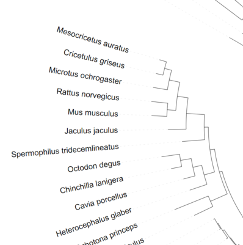
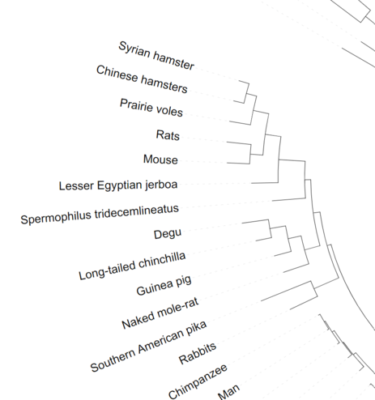

# Substitute scientific with common species names in a phylogenetic tree file

### Step 1 - Generate a table with the scientific-common name correspondence

We need the correspondence between the scientific and common species names as described in the [NCBI Taxonomy Database](https://www.ncbi.nlm.nih.gov/Taxonomy/Browser/wwwtax.cgi?mode=Info&id=10090&lvl=2&p=has_linkout&p=blast_url&p=genome_blast&lin=f&keep=1&srchmode=1&unlock).

We want to do this for any number of species automatically, so we download the entire archive taxdump.tar.gz from the [NCBI taxonomy database dump](ftp://ftp.ncbi.nlm.nih.gov/pub/taxonomy/).

This archive contains the `names.dmp` file with the format:
```
10090	|	house mouse	|		|	genbank common name	|
10090	|	LK3 transgenic mice	|		|	includes	|
10090	|	mouse	|	mouse <Mus musculus>	|	common name	|
10090	|	Mus musculus Linnaeus, 1758	|		|	authority	|
10090	|	Mus musculus	|		|	scientific name	|
10090	|	Mus sp. 129SV	|		|	includes	|
10090	|	nude mice	|		|	includes	|
10090	|	transgenic mice	|		|	includes	|
```

Make new folder for this exercise and `cd` into it. Download the file and extract the `names.dmp`

```
$ wget ftp://ftp.ncbi.nlm.nih.gov/pub/taxonomy/taxdump.tar.gz
$ tar -xvf taxdump.tar.gz names.dmp
```

```
taxdump.tar.gz    51MB
names.dmp        189MB 
```

- We want to convert this table into a tab delimited file with this format:
```
taxonID    scientific_name    common_name    genbank_common_name
10090      Mus musculus       mouse          house mouse
```
- We want to add an underscore between the genus (e.g. Mus) and the specific name of the species (e.g. musculus), so the scientific name is listed as in the tree file (e.g Mus_musculus).
- We want to capitalize the first word in the common name (if not already capitalized).

### Step 2 - Edit the phylogenetic tree file

The phylogenetic tree file used for the 100way alignment is hg38.100way.scientificNames.nh. 
It can be downloaded from [here](http://hgdownload.cse.ucsc.edu/goldenpath/hg38/multiz100way/) and details could be found [here](http://genomewiki.ucsc.edu/index.php/Phylogenetic_Tree).

Download the file (4.1KB).
``` bash
$ wget http://hgdownload.cse.ucsc.edu/goldenpath/hg38/multiz100way/hg38.100way.scientificNames.nh
```

The format of the tree file is
```
	((((((((((((((((((Homo_sapiens:0.00655,
                 Pan_troglodytes:0.00684):0.00422,
                Gorilla_gorilla_gorilla:0.008964):0.009693,
               Pongo_pygmaeus_abelii:0.01894):0.003471,
              Nomascus_leucogenys:0.02227):0.01204,
             (((Macaca_mulatta:0.004991,
               Macaca_fascicularis:0.004991):0.003,
              Papio_anubis:0.008042):0.01061,
             Chlorocebus_sabaeus:0.027):0.025):0.02183,
            (Callithrix_jacchus:0.03,
            Saimiri_boliviensis:0.01035):0.01965):0.07261,
           Otolemur_garnettii:0.13992):0.013494,
          Tupaia_chinensis:0.174937):0.002,
         (((Spermophilus_tridecemlineatus:0.125468,
```

See a description of the Newick tree format [here](https://en.wikipedia.org/wiki/Newick_format).

The phylogenetic tree could be visualized online at https://itol.embl.de/ (notice that this application takes care of removing the _ from the scientific name).


**Before**



**After**



---

### Step 1

:warning: **!!! WARNING !!! WARNING !!! WARNING !!!** :warning:

The files are in Windows/DOS `ASCII text, with CRLF line terminators` format which makes awk to misbehave. Check your files and convert them to UNIX format if necessary.

``` bash
# check the format
$ file filename
filename: ASCII text, with CRLF line terminators

# Convert to unix format
$ dos2unix filename
dos2unix: converting file filename to Unix format ...

# check again
$ file filename
filename: ASCII text
```

Let's first tabulate the *NCBI Taxonomy Database* in more convenient format for us - getting the relevant information on single line, replace some spaces with underscore symbol `_`, remove the extra blanks in fron and after the names, etc.

!!! example "names.tab"
    ```
    9605|Homo|Humans|
    9606|Homo_sapiens|Man|
    9608|Canidae|Dog, coyote, wolf, fox|
    9611|Canis||
    9612|Canis_lupus|Grey wolf|
    9614|Canis_latrans|Coyote|
    9615|Canis_lupus_familiaris|Dogs|
    9616|Canis_sp.||
    9619|Dusicyon||
    9620|Cerdocyon_thous|Crab-eating fox|
    9621|Lycaon||
    9622|Lycaon_pictus|Painted hunting dog|
    9623|Otocyon||
    9624|Otocyon_megalotis|Bat-eared fox|
    9625|Vulpes||
    9626|Vulpes_chama|Cape fox|
    9627|Vulpes_vulpes|Silver fox|
    9629|Vulpes_corsac|Corsac fox|
    9630|Vulpes_macrotis|Kit fox|
    9631|Vulpes_velox|Swift fox|
    
    ```

Might not be the best solution but it is easy to read and modify, for now. Note, we do not need to sort but it will look better if we have the final result in order.

``` bash
$ ./01.tabulate-names.awk names.dmp | sort -g -k 1 > names.tab

# Or with bzip2 compression "on the fly"
$ ./01.tabulate-names.awk <(bzcat names.dmp.bz2) | bzip2 -c > names.tab.bz2
```

??? note "01.tabulate-names.awk"
    ``` awk linenums="1"
    #!/usr/bin/awk -f
    BEGIN{
      FS="|"
    #  print "#taxonID scientific_name        common_name     genbank_common_name"
    }
    
    $4 ~ "scientific name"     { sciname[$1*1]=  unds(Clean($2)); next}
    
    $4 ~ "common name"         { com_name[$1*1]= Cap(Clean($2));  next}
    
    $4 ~ "genbank common name" { genbank[$1*1]=  unds(Clean($2)); next}
    
    END{
      for(i in sciname) print i"|"sciname[i]"|"com_name[i]"|"genbank[i]
    }
    
    # Function declarations ==============================
    
    function Clean (string){
      sub(/^[ \t]+/, "",string)
      sub(/[ \t]+$/, "",string)
      return string
    }
    
    function unds(string) { gsub(" ","_",string); return string}
    
    function Cap (string) { return toupper(substr(string,0,1))substr(string,2) }
    ```

---

### Step 2

Now we can use the tabulated data in `names.tab` and perform the replacement in `hg38.100way.scientificNames.nh` by matching the scientific names in `$2` with the common names in `$3` - we use `FS="|"`

```
((((((((((((((((((Man:0.00655,
                 Chimpanzee:0.00684):0.00422,
                Western lowland gorilla:0.008964):0.009693,
               Pongo_pygmaeus_abelii:0.01894):0.003471,
              White-cheeked Gibbon:0.02227):0.01204,
             (((Rhesus monkeys:0.004991,
               Long-tailed macaque:0.004991):0.003,
              Olive baboon:0.008042):0.01061,
             Green monkey:0.027):0.025):0.02183,
            (White-tufted-ear marmoset:0.03,
            Bolivian squirrel monkey:0.01035):0.01965):0.07261,
           Small-eared galago:0.13992):0.013494,
```

Again, this might not be the best way but it works. The suggested solutions could be easily merged into a single script. I would prefer to have them in steps, so I can make sure that the first step has completed successfully (*it takes some time*) before I continue. Also I can filter the unnecessary data in the newly tabulated file and use only relevant data or alter further if I need. 

``` bash
$ ./02.substitute.awk  names.tab  hg38.100way.scientificNames.nh > NEW.g38.100way.scientificNames.nh

# Or with bzip2 compression "on the fly"
$ ./02.substitute.awk <(bzcat names.tab.bz2) hg38.100way.scientificNames.nh > NEW.g38.100way.scientificNames.nh
```


``` bash
$ ./02.substitute.awk names.tab hg38.100way.scientificNames.nh
```
??? note "02.substitute.awk"
    ``` awk linenums="1"
    #!/usr/bin/awk -f
    BEGIN{
      FS="|"
    #  print "#taxonID scientific_name        common_name     genbank_common_name"
    }
    
    NR== FNR{ map[$2]= $3; next}
    
    {
      line= $0
      gsub("[0-9.,;:)( ]","")
      if ( $0 in map) sub($0,map[$0],line)
      print line
    }
    ```
