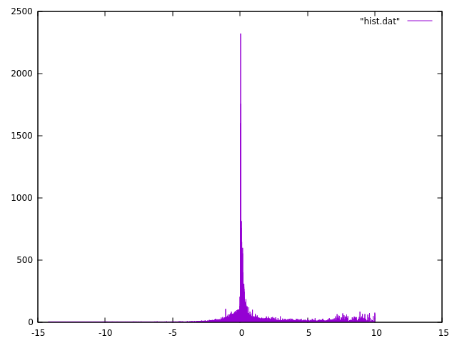
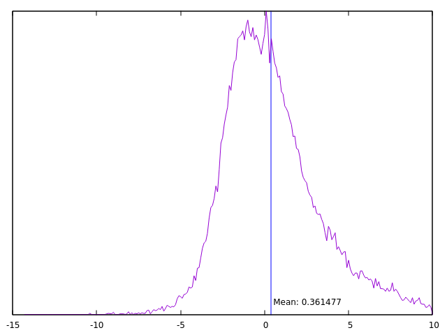

# Statistics on very large columns of values

> Problem formulated an presented at the workshop by [**Voichita Marinescu**](https://katalog.uu.se/empinfo/?id=N12-828), Department of Medical Biochemistry and Microbiology, _Comparative genetics and functional genomics_ 

When analyzing variables with large numbers of values, one needs to generate descriptive statistics (e.g. mean, median, std, quartiles, etc.) in order to set thresholds for further analyses.  This could easily be done in R if the vector or values could be loaded. But sometimes the number of values is prohibitively large for R, and even `pandas` in Python may fail.

One such example is provided by the conservation scores for each nucleotide position of the MultiZ alignment of 99 vertebrate genomes against the human genome ([UCSC 100way alignment](https://genome.ucsc.edu/cgi-bin/hgTrackUi?db=hg19&g=cons100way)). You visualized the phylogenetic tree for the species in this alignment in the previous exercise.  Using the program [phyloP (phylogenetic P-values)](https://citeseerx.ist.psu.edu/viewdoc/download?doi=10.1.1.84.6412&rep=rep1&type=pdf) from the [PHAST package](http://compgen.bscb.cornell.edu/phast), a conservation score is computed for each position in the human genome resulting in 3 billion values. To identify the most conserved positions (the ones with the highest phyloP scores) one would need to generate descriptive statistics for the score distribution and set thresholds accordingly.

We want to output the total number of values (count) and the mean, median, std, min, max, 10%, 25%, 75%, 90% of the score values, and also to plot the histogram.


## Input
The complete file in bigwig format is 5.5GB in size.

- **Do not download** the file `hg38.phastCons100way.bw` from
http://hgdownload.soe.ucsc.edu/goldenPath/hg38/phastCons100way/
- The bigwig format can be converted to wig format using bigWigToWig
           https://www.encodeproject.org/software/bigwigtowig/
- The wig format can be converted to bed format using wig2bed		https://bedops.readthedocs.io/en/latest/content/reference/file-management/conversion/wig2bed.html

For a short presentation of the main bioinformatics file formats see the [UCSC Data File Formats page](http://genome.ucsc.edu/FAQ/FAQformat.html).


In this exercise we will not work with complete file, but with smaller files downloaded using the [UCSC Table Browser](https://genome.ucsc.edu/cgi-bin/hgTables).
	
We will use a 400kb interval on [chr17:7,400,001-7,800,000](https://genome.ucsc.edu/cgi-bin/hgTracks?db=hg38&lastVirtModeType=default&lastVirtModeExtraState=&virtModeType=default&virtMode=0&nonVirtPosition=&position=chr17%3A7400001%2D7800000&hgsid=888334651_PCIreNQEonlZAkh3wGNxBOcU9hkB) 


The Table Browser allows downloads for up to 100kb.

- chr17_7.400.001-7.500.000.data
- chr17_7.500.001-7.600.000.data
- chr17_7.600.001-7.700.000.data
- chr17_7.700.001-7.800.000.data

:warning: **!!! WARNING !!! WARNING !!! WARNING !!!** :warning:
 
The files are in Windows/DOS `ASCII text, with CRLF line terminators` format which makes awk to misbehave. Check your files and convert them to UNIX format if necessary.

``` bash
# check the format
$ file filename
filename: ASCII text, with CRLF line terminators

# Convert to unix format
$ dos2unix filename
dos2unix: converting file filename to Unix format ...

# check again
$ file filename
filename: ASCII text
```

The phyloP scores are in the second column.

## Compute statistics

The memory problem for large data could be solved in Python with [Dask](https://dask.org/). Since the analysis uses approximate methods for the quartile and other percentiles, you might need to resort to `percentiles_method="tdigest"` which improves the final results.

Here we will rely on the specifics of the data to implement an easy trick in awk (you can do it in any another language as well). We will calculate a discrete histogram over the values in the second column in the files. This generates too many elements, but looking into the data we can see that resolution is up to the 3 decimal points... So we will reduce the numbers (which in this case is even unnecessary but might be become a potential problem).

## Step 1

``` bash
$ ./01.histogram.awk *.data.txt | sort -g -k 1 > hist.dat
```

`01.histogram.awk`
``` awk linenums="1"
#!/usr/bin/awk -f
#BEGIN{CONVFMT="%.3f"}  # Uncomment if necessary

NF==2 { counts[$2*1]++ }

END { for (v in counts) print v, counts[v] }
```

## Step 2

Let's see what we got.
``` gnuplot
plot "hist.dat" with line
```



You can use other programs to make the histograms in intervals - here we can use gnuplot as example:

``` gnuplot linenums="1"
#!/usr/bin/gnuplot -persist
set nokey
set noytics

# Find the mean
mean= system("awk '{sum+=$1*$2; tot+=$2} END{print sum/tot}' hist.dat")

set arrow 1 from mean,0 to mean, graph 1 nohead ls 1 lc rgb "blue"
set label 1 sprintf(" Mean: %s", mean) at mean, screen 0.1

# Histogram
binwidth=0.1
bin(x,width)=width*floor(x/width)
plot 'hist.dat' using (bin($1,binwidth)):(1.0) smooth freq with lines
```




## Step 3

Let's find some relevant numbers from `hist.dat`.

``` awk hl_lines="1 4"
$ head -n 1 hist.dat | awk '{print "min:\t"$1}'
min:    -14.247

$ tail -n 1 hist.dat | awk '{print "max:\t"$1}'
max:    10.003
```

This was easy. How about the real numbers we are after?  
We need ianother program - again you can do it in other languages as well.

``` bash hl_lines="1"
$ ./stats.awk hist.dat
count: 398516
mean: 0.361477
10% :-0.973866
25% :-0.326732
50% :0.127701
75% :0.53989
90% :1.72925
```

`stats.awk`
``` awk linenums="1"
#!/usr/bin/awk -f
BEGIN {
  # Here sorting is very important, so we can count 
  # all elemnts in ascending numerical order for the indexes - first column
  PROCINFO["sorted_in"] = "@ind_num_asc" 
}

{
  counts[$1]+= $2
  sum+= $1*$2
  total+= $2
}

END {
  quantiles[1]=10;
  quantiles[2]=25;
  quantiles[3]=50;
  quantiles[4]=75;
  quantiles[5]=90;
  q=1; nq=5
  quantile=quantiles[q]

  print "count: "total
  print "mean: " sum/total

  for (v in counts) {
    comul+= counts[v]
    if (comul >= total*quantile/100) {
      print quantiles[q]"% :" v
      if (q < nq) quantile= quantiles[++q]
      else exit
    }
  }
}
```
