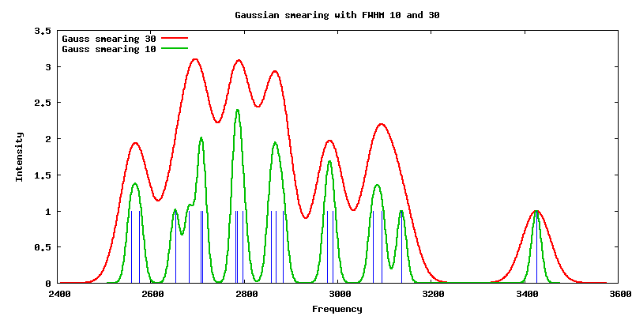

# Gaussian smearing
Sometimes it is useful or necessary to apply Gaussian smearing on your discrete values. For example if you want to add temperature broadening on theoretically calculated spectra (from Lattice Dynamics, normal mode analysis etc.).

Here is a code that shows how it could be done in awk (_illustrating the use of functions as well_).

``` awk linenums="1"
#!/usr/bin/awk -f
BEGIN{
  FWHM=30; # Default smearing if none is provided on the command line
  FWHM= FWHM/2.35482
  # trick to read parameters from the command line
  if (ARGC==3) FWHM=ARGV[2];  ARGC=2; 
}

!/#/ {
  f++;
  if (f==1) {fmin=$1; fmax=$1}

  freq[f]=$1;
  if (fmin > $1) fmin=$1;
  if (fmax < $1) fmax=$1;
  nfreq=f;
}

END {
  print "# freq   intensity | nfreq: "nfreq" fmin: "fmin" fmax: "fmax
  for (i=int(fmin -5*FWHM); i<=int(fmax +5*FWHM);i++){
    for (f=1;f<=nfreq;f++){
      data[i]= data[i] + gauss(freq[f],i,FWHM);
    }
    print i,data[i]
  }  
}

function gauss(x0,x,c){
  area=1;
  if ((x-x0)**2 < 10000) { return  area*exp(-(((x-x0))**2)/(2.*c**2))}
  else {return 0.0}
}
```

Here are a couple of interesting (_or not_) points in the code.

In the `#awk BEGIN` section, we define default `FWHM` value in case none is provided on the command line. There are minimum checks that facilitate the command line input. When the script is executed, the argument values are stored in `#!awk ARGV` array and the number of arguments in `#!awk ARGC`. The zeroth element is the script's name itself. 1st will have the first parameter and so on. So, if `#!awk ARGC==3` (0, 1 and 2 will count as 3) then we set the second argument as `FWHM` in our script and decrease the `#!awk ARGC` back to 2 to trick the script that we have only 2 parameters on the command line. Otherwise, awk will try to read our 3rd parameter as a regular file.

Then, for each line that is not a comment, the script reads the value in the first column and store it locally, while trying to keep track of the smallest and greatest value. 

The `#!awk END` section, essentially runs a loop over a range slightly larger than `fmax-fmin` and in turns `for (f=1;f<=nfreq;f++)` calculates Gaussian contribution from each peak.

The last section in the script is a user defined function for the [Gaussian function](https://en.wikipedia.org/wiki/Gaussian_function) with small precautions to avoid errors when the numbers become unreasonably small.

To run the script:
``` bash
./Gauss-smearing.awk freq.dat 10
```


Here is the result from a Gnuplot script that calls the awk script directly, that avoids unnecessary creation of temporary files.


All scripts and data files are attached bellow.

!!! example "Files"
    * [gauss-smear-data.awk](../data/gauss-smear-data.awk)
    * [freq.dat](../data/freq.dat)
    * [ps-plot-v01.gnu](../data/ps-plot-v01.gnu) - Gnuplot script


!!! comment 
    The script requires only small changes to handle intensities as well, can you do it yourself?
  
