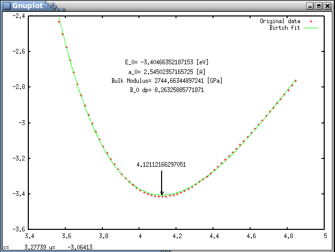

# Awk and Gnuplot

## Using awk to fit [Birch–Murnaghan equation of state](https://en.wikipedia.org/wiki/Birch%E2%80%93Murnaghan_equation_of_state) and show the results.

I have written this script a long time ago, before Gnuplot had the options to print its own variables on the plot. Nowadays, it is possible to make the fit entirely from Gnuplot, although it will be still tricky to make some decisions if you want to align some labels.

Perhaps the most valueable part is the demonstartion of simultaneous output/input to external program (Gnuplot in this case) `#!awk while ((gnu |& getline) > 0)` and for future reference.

``` awk
#!/usr/bin/awk -f
#############################################################################
#                                                                           #
# GNU License - Author: Pavlin Mitev                                        #
# Version 0.3 - Original code from A. Papaconstantopoulos                   #
# http://cst-www.nrl.navy.mil/bind/static/index.html                        #
#                                                                           #
# Fits Birch equation to obtain equilibrion energy, equilibrium lattice     #
# constant, bulk modulus, and pressure derivative of the bulk modulus.      #
#                                                                           #
# REMARK: FCC version; affects the estimation of eq.latt. constant          #
#                                                                           #
# Format of the input file:                                                 #
# Atomic_Volume_in_Angstroms   Energy_per_atom_in_eV                        #
#                                                                           #
#############################################################################
BEGIN {
  if (ARGC>2) {
    gnu="(gnuplot -persist >& /dev/stdout)";
    vfw=ARGV[2];
    print "t(vo,v) = (vo/v)**(2./3.) - 1.0;" |& gnu
    print "e(eo,vo,ko,kop,v) = eo + 1.125*ko*vo*t(vo,v)*t(vo,v)* (1.0 + 0.5*(kop-4.0)*t(vo,v));" |& gnu ;
    print "ef=1; vf="vfw"; kf=0.1; kfp=4;" |& gnu ;
    print "fit ["ARGV[3]":"ARGV[4]"] e(ef,vf,kf,kfp,x) \""ARGV[1]"\" via ef,vf,kf,kfp;" |& gnu;
    print "print \"Results of 3rd order Birch fit:\";" |& gnu ;
    print "print \"E_0 = \",ef,\" Ev\";" |& gnu ;
    print "print \"V_0 = \",vf,\" Angstrom**3\";" |& gnu ;
    print "af = (4.0*vf)**(1./3.);" |& gnu ;
    print "print \"a_0 = \",af,\" Angstrom\";" |& gnu ;
    print "kfx = 160.21765*kf;" |& gnu ;
    print "print \"B_0 = \",kfx,\" GPa\";" |& gnu ;
    print "print \"B_0d pressure derivative= \",kfp;" |& gnu ;
#    close(gnu,"to");
    while ((gnu |& getline) > 0) {
      print $0;
      if ($1=="E_0") {
        print "set label \"E_0= "$3" [eV]\" at screen  0.5, 0.78 center" |& gnu;}
      if ($1=="V_0") {
        vfw= $3;}
      if ($1=="a_0") {
        print "set label \"a_0= "$3" [A]\" at screen  0.5, 0.74 center" |& gnu;}
      if ($1=="B_0") {
        print "set label \"Bulk Modulus= "$3" [GPa]\" at screen  0.5, 0.70 center" |& gnu;}
      if ($1=="B_0d") {
        print "set label \"B_0 dp= "$4"\" at screen  0.5, 0.66 center" |& gnu;
        print "set label \""vfw"\" at  first "vfw", ef*0.95 center" |& gnu;
 print "set arrow from "vfw",ef*0.96 \
               to "vfw",ef" |& gnu;
        print "plot \""ARGV[1]"\" title \"Original data\" w p,\
   e(ef,vf,kf,kfp,x) title \"Birtch fit\"" |& gnu;
        close(gnu); exit(0)
      }
    }
  }else {
    print "Syntax:";
    print "Bulk  datafile_name  atomic_volume_near_equilibrium [lower_limit [upper_limit]]"
    print "Read the source code for details";
    print "";
  }
}
```

Without parameters, it prints the syntax...
``` bash
$ ./Bulk-Modulus-Birch-FCC-Vol-A-eV.awk
Syntax:
Bulk  datafile_name  atomic_volume_near_equilibrium [lower_limit [upper_limit]]
Read the source code for details
```

Here how it works.
``` bash
./Bulk-Modulus-Birch-FCC-Vol-A-eV.awk bulkm.r-e.dat 4
```


!!! example "Files"
    * [Bulk-Modulus-Birch-FCC-Vol-A-eV.awk](../data/Bulk-Modulus-Birch-FCC-Vol-A-eV.awk)
    * [bulkm.r-e.dat](../data/bulkm.r-e.dat)


