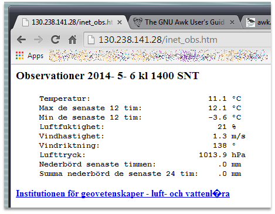

# Awk and networking
Here is just an example that illustrates the awk ability to communicate over common network protocols. Please, read the awk [documentation](http://www.gnu.org/software/gawk/manual/gawkinet/html_node/Using-Networking.html#Using-Networking) for detailed explanation of the commands.

On this Internet address http://130.238.141.28/inet_obs.htm one can find some real-time weather data. The script below extracts the raw values and print them on the screen (or uses the old Linux notification tool to show it on the desktop /_commented out in this example_/).

``` awk
#!/usr/bin/awk -f
BEGIN{
  RS=ORS="\r\n"
  http="/inet/tcp/0/130.238.141.28/80"
  print "GET http://130.238.141.28/inet_obs.htm"  |& http

  while ((http |& getline) > 0) {
    if (match($0,"Temperatur:"))    ss=   sprintf("         Temp :%6g°C \n",$2)
    if (match($0,"Luftfuktighet:")) ss=ss sprintf("Rel. humidity :%6g%  \n",$2)
    if (match($0,"Vindhastighet:")) ss=ss sprintf("   Wind speed :%6gm/s\n",$2)
    if (match($0,"Lufttryck:"))     ss=ss sprintf("Atm. pressure :%6ghPa\n",$2)
  }

  close(http)
  #cmd="echo -e '"ss"' | "osd" &"; system(cmd); close(cmd);
  print ss
}
```
```
         Temp :  11.1°C
Rel. humidity :    21%
   Wind speed :   1.3m/s
Atm. pressure :1013.9hPa
```


How about simple web server? [http://rosettacode.org/wiki/Hello_world/Web_server#AWK](http://rosettacode.org/wiki/Hello_world/Web_server#AWK)
