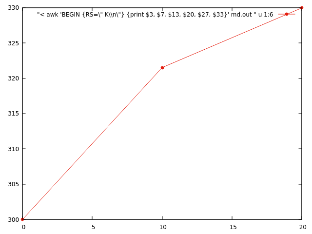

# 03.Data extraction **

The output from a molecular dynamics (MD) program looks like the one bellow. Although it is easy to read, it is rather inconvenient to analyse the data. 

!!! note "md.out"
    ```
    MD step:           0
    Pressure:                           0.332328E-03 au     0.977743E+10 Pa
    Potential Energy:               -1039.8363386148 H       -28295.3864 eV
    MD Kinetic Energy:                  1.0930263164 H           29.7428 eV
    Total MD Energy:                -1038.7433122983 H       -28265.6437 eV
    MD Temperature:                     0.0009500446 au         300.0000 K
    MD step:          10
    Pressure:                           0.335165E-03 au     0.986088E+10 Pa
    Potential Energy:               -1039.9197980557 H       -28297.6575 eV
    MD Kinetic Energy:                  1.1714204733 H           31.8760 eV
    Total MD Energy:                -1038.7483775824 H       -28265.7815 eV
    MD Temperature:                     0.0010181838 au         321.5166 K
    MD step:          20
    Pressure:                           0.348121E-03 au     0.102421E+11 Pa
    Potential Energy:               -1039.9631365733 H       -28298.8368 eV
    MD Kinetic Energy:                  1.2021764632 H           32.7129 eV
    Total MD Energy:                -1038.7609601101 H       -28266.1239 eV
    MD Temperature:                     0.0010449165 au         329.9581 K
    ```

a) Write an Awk script to collect the "MD temperature" in one column vs. the "MD step" i.e. which is much nicer format to plot, analyze or read by other programs.

```
0  300.0000
10 321.5166
20 329.9581
```

b) Can you tabulate all values against the "MD step"


Output:
```
0  0.977743E+10 -28295.3864 29.7428 -28265.6437 300.0000
10 0.986088E+10 -28297.6575 31.8760 -28265.7815 321.5166
20 0.102421E+11 -28298.8368 32.7129 -28266.1239 329.9581
```

??? "Possible solutions:"

    a) 
    ``` awk 
    $ awk '/MD step/{step= $3} /MD Temperature:/ {print step, $5 }' md.out
    ```
    
    b) here is an easy solution:
    ``` awk 
    $ awk '/MD step/{step= $3; getline; press= $4; getline; pe= $5; getline; ke= $6; getline; te= $6; getline; t=$5; print step,press,pe,ke,te,t} ' md.out
    ```
    here is an alternative solution using "multi-line records". Each "MD step" ends with space,"K", then new line. Note that there is no other line ending the same way, otherwise this will not work. So, we define "Record separator" RS=" K\n" then each record will have 33 fields (print NF to see if it is correct).
    ``` awk
    $ awk 'BEGIN {RS=" K\n"} {print $3, $7, $13, $20, $27, $33}' md.out
    ```
??? "gnuplot tips"
    Here is an example if you want to quickly visualize the output with `gnuplot`. Note the additional escape character`\` in front of `"` and "\n".
    ``` gnuplot title="$ gnuplot"
    plot "< awk 'BEGIN {RS=\" K\\n\"} {print $3, $7, $13, $20, $27, $33}' md.out " u 1:6 w lp lt 7
    ```
    