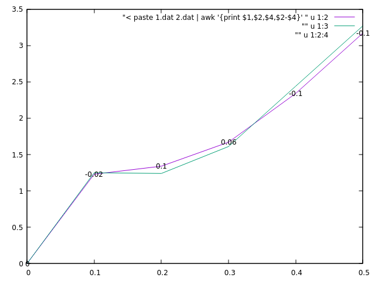

# 04.Data manipulation **
You have 2 files containing results from two similar experiments.  
You want to calculate the difference between the numbers in the second columns. 

=== "1.dat"
    ```     
    0.0   0.00
    0.1   1.23
    0.2   1.34
    0.3   1.67
    0.4   2.34
    0.5   3.17
    ```

=== "2.dat"
    ```
    0.0   0.00
    0.1   1.25
    0.2   1.24
    0.3   1.61
    0.4   2.44
    0.5   3.27
    ```

Try to use awk and any other tools to produce a file that has the results from both files and the difference between the second column in last column in the new file i.e.

```
0.0  0.00  0.00  0
0.1  1.23  1.25  -0.02
0.2  1.34  1.24  0.1
0.3  1.67  1.61  0.06
0.4  2.34  2.44  -0.1
0.5  3.17  3.27  -0.1
```


??? "Possible solutions:"
    ``` awk
    $ paste 1.dat 2.dat | awk '{print $1,$2,$4,$2-$4}'
    ```
    
    Note: This will not work under OS X
    ``` awk
    $ awk 'ARGIND==1 {x1=$1;y1=$2; getline < ARGV[2]; printf("%g  %g  %g  %g  %g\n",x1,y1,$1,$2,y1-$2);}' 1.dat 2.dat
    ```
    
    Note: This might work under OS X
    ``` awk
    $ awk 'FILENAME=="1.dat" {x1=$1;y1=$2; getline < ARGV[2]; printf("%g  %g  %g  %g  %g\n",x1,y1,$1,$2,y1-$2);}' 1.dat 2.dat
    ```
    
    
    ``` awk
    $ awk 'BEGIN{ while (getline < ARGV[1]) {x1=$1;y1=$2; getline < ARGV[2]; printf("%g  %g  %g  %g  %g\n",x1,y1,$1,$2,y1-$2);}}' 1.dat 2.dat
    ```

    ``` awk
    # contribution by Johan Zvrskovec 2020.08.28
    awk 'NR==FNR{n1[$1]=$2;} NR!=FNR{print ($1,n1[$1],$2,$2-n1[$1])}' 1.dat 2.dat
    ```

??? "gnuplot tips"
    Here is an example that visualizes the newly tabulated data.
    ``` gnuplot title="$ gnuplot"
    plot "< paste 1.dat 2.dat | awk '{print $1,$2,$4,$2-$4}' " u 1:2 w l, "" u 1:3 w l, "" u 1:2:4  w labels
    ```
    
    
    Or even simpler, since gnuplot can make some calculations on the fly.
    ``` gnuplot title="$ gnuplot"
    plot "< paste 1.dat 2.dat " u 1:2 w l, "" u 1:4 w l, "" u 1:2:($2-4)  w labels
    ```

## Trimming data

Let's have some data file that that contains 60 lines with one number per line. We can think that this is a result of some measurement at every one minute. You can create a file with name 'rnd.dat' containing 60 lines with randomly generated numbers between 0 and 1 with the following awk script (redirect the output to a file).

``` awk
$ awk 'BEGIN{ for(i=1;i<=60;i++) print rand() }'

0.924046
0.593909
0.306394
...
0.160044
0.438791
0.98955
```

Note that it is not coincidence that you have generated the same numbers as on this page. It becomes easier to check against the results in the suggested solutions. To randomize the random seed you need to add `srand()` in the script like this: `awk 'BEGIN{ srand(); for(i=1;i<=60;i++) print rand() }'`


Can you print/extract the values for every 5th minute/line?

??? "Possible solution"
    ``` awk
    awk 'NR%5 == 0 {print $0}' rnd.dat

    0.740133
    0.100887
    0.426298
    0.119752
    0.399686
    0.956569
    0.984306
    0.173531
    0.84918
    0.433507
    0.884823
    0.98955
    ```

Can you print the average for each 5 rows of the data?

??? "Possible solution"
    ``` awk
    awk '{s=s+$1} NR%5 == 0 {print $0/5;s=0}' rnd.dat

    0.148027
    0.0201774
    0.0852596
    0.0239504
    0.0799372
    0.191314
    0.196861
    0.0347062
    0.169836
    0.0867014
    0.176965
    0.19791
    ```
