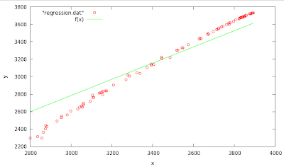
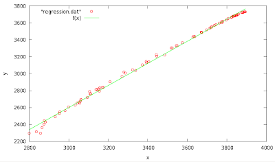

# Simple Linear Regression [Wikipedia](https://en.wikipedia.org/wiki/Simple_linear_regression)

The purpose of this exercise is not to learn about "Linear regression" but to exercise some simple awk operations on simple data sets that will be equivalent to performing of a simple linear regression calculation. **You might be surprised how easy it could be done...**

The file "regression.dat" contains 2 rows of numbers, for convenience named as $x_i$ and $y_i$, where $i$ is the row (line) number. I will try to follow the nomenclature described on the wikipage.

Suppose there are $n$ data points ${(x_i, y_i), i = 1, ..., n}$. The function that describes $x$ and $y$ is:

$y_i = \alpha + \beta x_i + \varepsilon_i$.

The goal is to find the equation of the straight line

$y=\alpha +\beta x$,

which would provide a "best" fit for the data points. Let, at the begging, assume $\alpha=0$  which will result to a "best" fit of a straight line which passes through the origin $(0,0)$. There is a simple expression on how to obtain the $\beta$ parameter

${\displaystyle {\hat {\beta }}={\frac {\sum _{i=1}^{n}x_{i}y_{i}}{\sum _{i=1}^{n}x_{i}^{2}}}={\frac {\overline {xy}}{\overline {x^{2}}}}}$

1. Write an awk script (or one line) that will calculate the beta from the equation above.  
   _You will be sutprised how easy it could be calculated..._  
   The correct answer for $\displaystyle {\hat {\beta}}$ is 0.928142
2. Write two scripts, one for the average values $\overline {x}, \overline {y}$ and then use the numbers in the second (_directly in the code_), to obtain the results in the case when $\alpha$ is not constrained to $0$.  
   Answer: $\displaystyle {\hat {\alpha}}=-1314.16; \displaystyle {\hat {\beta}}=1.30453$.

${\displaystyle {\hat {\beta }}={\frac {\sum _{i=1}^{n}(x_{i}-\overline {x})i(y_{i}-\overline {y})}{\sum _{i=1}^{n}(x_{i}-\overline {x})^{2}}}}$

${\displaystyle {\hat {\alpha }}=\overline {y}-\displaystyle {\hat {\beta }}\overline {x}}$

You can use any program you want, to compare the results for the corresponding linear fit. Here is a solution in gnuplot:
``` gnuplot
f(x)=a+b*x
a=0
fit f(x) "regression.dat" via b

Final set of parameters            Asymptotic Standard Error
=======================            ==========================
b               = 0.928142         +/- 0.004221     (0.4548%)
```


``` gnuplot
f(x)=a+b*x
fit f(x) "regression.dat" via a,b

Final set of parameters            Asymptotic Standard Error
=======================            ==========================
a               = -1314.16         +/- 27.58        (2.099%)
b               = 1.30453          +/- 0.00794      (0.6086%)
```



??? "Possible solutions:"

    1)  
    ``` awk 
    $ awk '{up= up + $1*$2; down= down + $1*$1;} END{print up/down}' regression.dat
    0.928142
    ```
    
    2)  
    ``` awk
    $ awk '{x= x + $1; y= y + $2;N=NR} END{print x/N, y/N}' regression.dat
    3455.49  3193.63
    ```
    ``` awk
    $ awk '{up= up + ($1-3455.49)*($2-3193.63); down= down + ($1-3455.49)**2} END{print "b="up/down" a="3193.63-up/down*3455.49}' regression.dat
    b=1.30453  a=-1314.16
    ```

!!! example "Files"
    * [regression.dat](../data/regression.dat)
