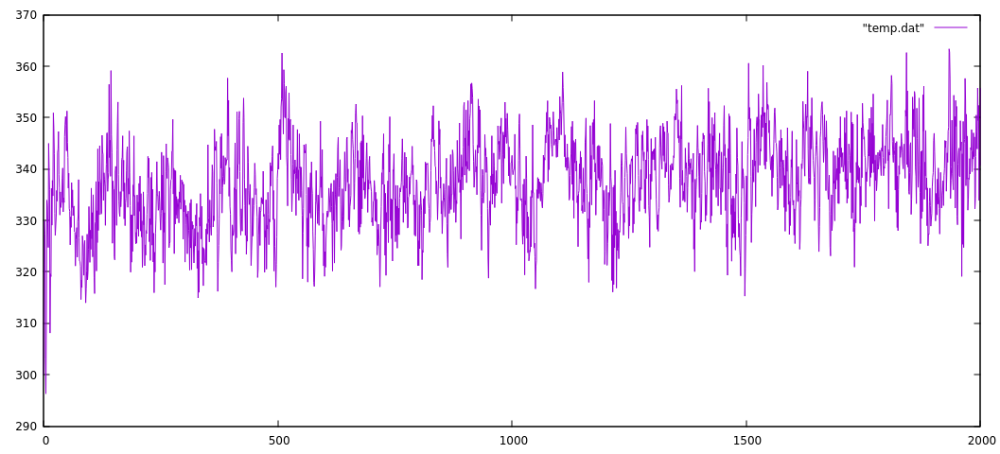
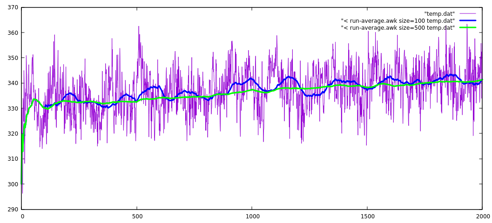

# Running/moving/rolling average

Definition on [Wikipedia](https://en.wikipedia.org/wiki/Moving_average#Simple_moving_average)

Here is an example from my own experience illustrated with a typical problem.  
On the figure below I have series of numbers (_in this case, the instantaneous temperature from a an MD simulation_) with some typical oscillations. By now, you know how to easily calculate an average and select certain region (_I would prefer to skip at least 100 steps from the beginning..._ ). Anyway, there is an easier way to visualize the averages by computing the running average over selected interval. It is a commonly visualized property on stock prices [link](https://commodity.com/technical-analysis/ma-simple/) for example.



There are countless solutions that you can find on the net. They do the same, but some are more efficient or elegant than others. Some time ago I wrote myself a small code, then improved several times and then I found a "brilliant" solution somewhere on the net. Here is the script itself - completely unreadable... The highlighted lines are added for flexibility - to select the column and the range for averaging.

!!! example "run-average.awk"
    ``` awk hl_lines="3 4" linenums="1"
    #!/usr/bin/awk -f
    {
      if (!col)  col = 1
      if (!size) size= 5
      mod= NR%size; 
      if(NR <= size){count++}
      else{ sum-= array[mod] };
      sum+= $(col); array[mod]= $(col);
      print sum/count
    }
    ```

Here is how the result from the script looks like.



This plot is generated from the Gnuplot command line 
``` gnuplot
plot [:2000] "temp.dat" w l, \
             "< ./run-average.awk size=100 temp.dat" w l lw 3 lc rgb "blue", \
             "< ./run-average.awk size=500 temp.dat" w l lw 3 lc rgb "green"
```

This easily "filters out" the oscillations and showing the averages for the selected size... Even more the not-so-easy to see drift is clearly visible now (_green line_).

Essentially, the program makes an average over selected size range of the previous data at each point. What is particularly smart wit this solution is that the average is done by updating the sum from numbers kept in an  array of size `size`. At every line, the new value is added to the sum and one is subtracted - the one that falls now outside the range for averaging. The position of the element is derived by the reminder computed by the [modulo operation](https://en.wikipedia.org/wiki/Modulo_operation) `#!awk mod= NR%size` [^1].  
In principle, the code is only two lines, but the rest is taking care of the initial region where the data is not enough to make an average over the specified `size`.

This is a smart realization of [FIFO](https://en.wikipedia.org/wiki/FIFO_(computing_and_electronics)) (first in first out) manipulation of data structure implemented on few lines in this script. Compare this to the code referred in the [wikipage](https://en.wikipedia.org/wiki/FIFO_(computing_and_electronics)#Code).

!!! note
    I have used to pass different parameters `size=100` and `size=500` directly in the gnuplot command instead of a filename (_not all programs allow you to make such neat substitutions_) but this is one example where awk gets handy - just write you one line script between `"< "`.

> The value of such programs is that it makes it easy to add or modify small bits, since there is not much of a code anyway. 

[^1]: [Gnuawk: Arithmetic Operators](https://www.gnu.org/software/gawk/manual/html_node/Arithmetic-Ops.html)

!!! example "Files"
    * [run-average.awk](../data/run-average.awk)
    * [temp.dat](../data/temp.dat)

